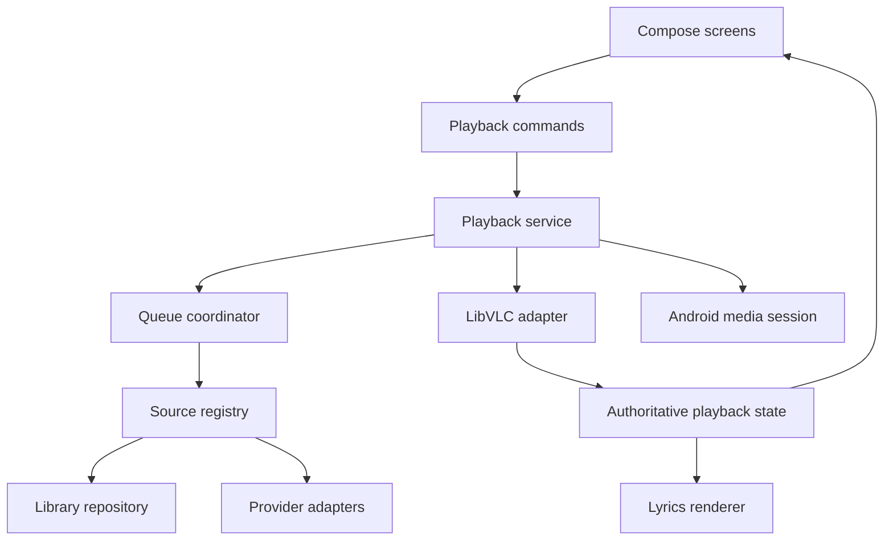

# Architecture

## Technology decision
Kotlin + Compose for Android UI and application logic. LibVLC for all media decoding/playback. Media3 session components may wrap a custom Player adapter; ExoPlayer is not required. Kotlin for an embedded LAN server after an Android compatibility spike. Custom C++ only for measured DSP/mixing needs.

LibVLC has native implementation already. Calling it from Kotlin does not move audio decoding into Kotlin.

## Ownership
| Component | Owns | Must not own |
|---|---|---|
| UI and ViewModels | Screen state, user intent and appearance slots | Native player lifetime |
| Playback service | Audio focus, queue execution, engine lifetime, session and transitions | Library scanning |
| LibVLC adapter | Play/pause/seek, engine callbacks and resource disposal | Recommendations |
| Queue coordinator | Ordered entries, explicit-user versus suggested entries, restore | Provider credentials |
| Library repository | Metadata, source IDs, scan generations, artwork references | Audio output |
| Source registry | Provider instances, capabilities, stream resolution | Direct playback |
| Smart queue | Candidate ranking and explanations | Silent changes to user queue |
| Lyrics repository | Parsing, selection and timing documents | Independent playback clock |
| Share session | Allowlisted tracks and guest permissions | Arbitrary filesystem access |

## Runtime topology

## Proposed modules
Start with six modules: app, core-model, core-playback, core-library, core-design and extensions-api. Keep early features as packages until their contracts stabilize.

Later modules: feature-lyrics, feature-smartqueue, feature-commands, feature-sharing, provider-local, provider-subsonic, provider-jellyfin, provider-custom and optional native-dsp.

Only native-dsp needs custom NDK/CMake code. Choose final dependency versions in M0; do not copy stale version snippets.

## Core records
Track: internal ID, source instance, provider track ID, title, artists, album, duration, artwork reference, metadata fields and provenance.
QueueEntry: stable entry ID, track reference, origin, pinned flag and playback preferences.
ResolvedStream: content URI or URL, headers, MIME, expiry, seek capability, length when known and cache/share policy.
LyricsDocument: plain/line/word timing, track identity, attribution, parser version and offset.
TrackFeatures: analyzer version, feature values, confidence and source-file fingerprint.

Do not persist expiring stream URLs as track identity. Do not merge distinct recordings solely by title. Maintain source-scoped IDs and a separate equivalence relation.

## Index and storage
Room tables: tracks, artists, albums, source_instances, queue_entries, playback_checkpoint, playlists, playlist_entries, lyrics_documents, track_features, user_labels and listen_events.
DataStore: settings, selected preset and feature toggles.
App-private cache: bounded artwork, optional streams and analyzer outputs.
Keystore-backed credential encryption: source secrets; public metadata stays separate.

Index incrementally using source/file changes and scan generations. Avoid hashing every entire file on every launch. User-selected SAF folders keep persisted permission; revoked or unavailable documents become unavailable tracks without deleting user playlist history.

## Threading and state
Confine LibVLC calls and callback-to-state reduction to a controlled dispatcher compatible with its API requirements. Coroutines perform scanning/network work. Copy immutable snapshots to UI. Batch JNI data transfer if custom DSP is introduced.

Player state includes active item, position, rate, buffering, error, repeat, shuffle and transition state. Position estimates reconcile with native clock; lyrics must not invent a separate timer.

## Crossfade state machine
Idle → Preparing incoming → Ready → Overlapping → Committing → Idle.
Failure before overlap returns to outgoing playback. Pause suspends both. Skip/seek chooses and documents a cancellation policy. Audio focus loss obeys platform behavior. Queue mutation invalidates pending preloads.

For two-player experiments, report one logical item externally and test timing on actual output. Offload, output routes and sample rates may change results. Equal-power ramps require headroom; audible clipping is a failed gate.

## Recovery
Persist queue transactions and periodic checkpoints without a write every frame. Restore paused after process death unless Android/user policy permits playback resumption. Regenerate streams from provider IDs. Dispose players and network sessions when their owners stop.

## Extension seam
Provider code supplies descriptors. Core resolves, plays and reports failures. Plugins never receive arbitrary Room/engine access. Internal module APIs and external IPC schemas share semantic models but need separate transport implementations.
