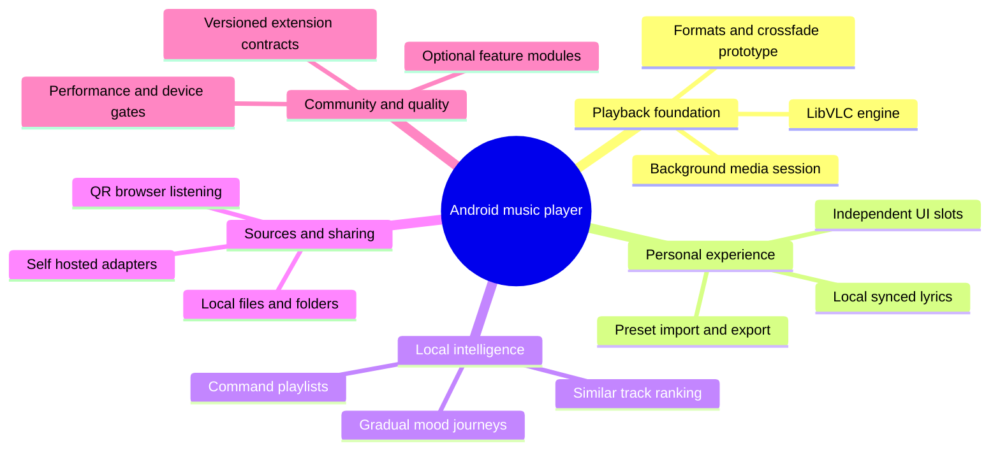

# Product and implementation mind map

View the [SVG diagram](MIND-MAP.svg) or [PNG preview](MIND-MAP.png). This Mermaid source is editable.

## Dependencies that determine build order
Playback and queue recovery precede UI expansion. Source identities precede mixed-source queues. A deterministic ranking baseline precedes acoustic ML. A trusted local share session precedes remote sharing or listen-together. External executable plugins follow a stable SDK.

## Release split
Core alpha: local playback, artwork, lyrics, queue recovery.
Personal beta: UI slots, verified crossfade, command playlists, similar mode.
Connected beta: one self-hosted source and LAN browser listening.
Later: optional acoustic model, mood journeys, external plugins and synchronized listening.
